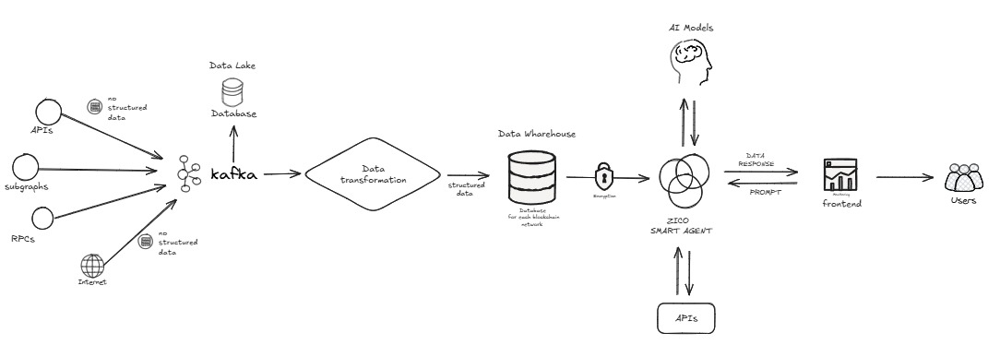
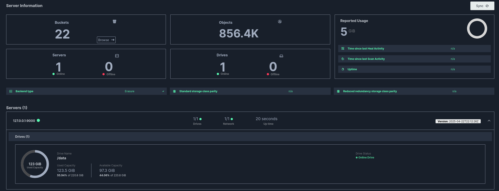
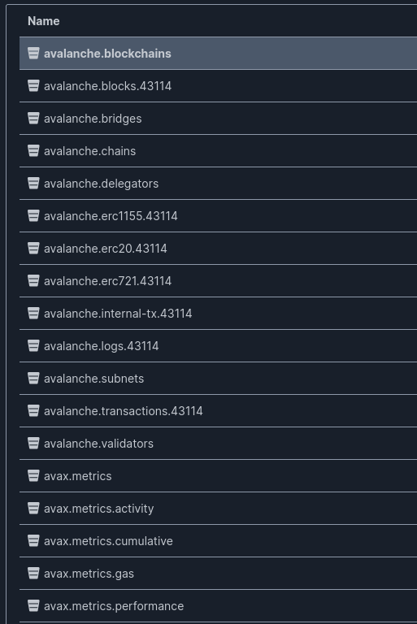
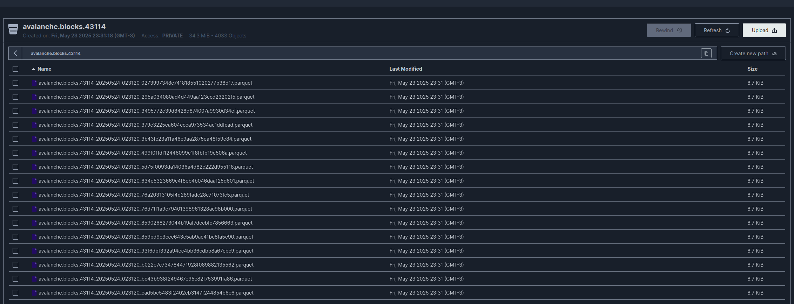
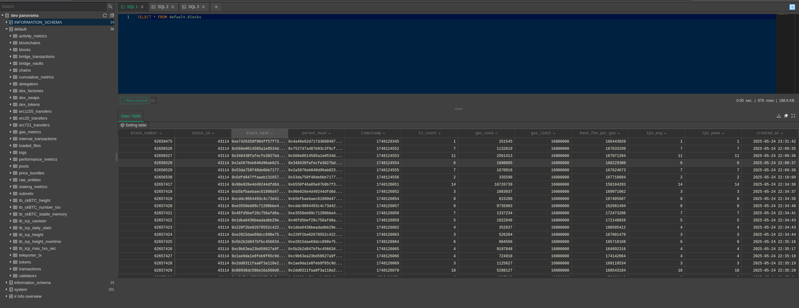

# ETL Pipeline for Blockchain Data

This repository contains an ETL (Extract, Transform, Load) pipeline designed for processing blockchain data from AVAX. The pipeline is built using Python and integrates with various data processing and storage technologies.

## 🚀 Features

- Data extraction from blockchain AVAX sources
- Data transformation and processing using Pandas and PySpark
- Data loading into ClickHouse database
- Integration with Kafka for message streaming
- MinIO integration for object storage
- REST API interface using Flask
- Comprehensive test suite

## 📊 Project Overview

### Architecture



The ETL pipeline is designed with a modular architecture that consists of several key components:

1. **Data Extraction Layer**
   - Connects to blockchain data sources
   - Implements rate limiting and error handling
   - Supports multiple data formats and protocols
   - Handles data validation and initial quality checks

2. **Data Processing Layer**
   - Utilizes Pandas for data transformation
   - Implements PySpark for large-scale data processing
   - Performs data cleaning and normalization
   - Handles data enrichment and feature engineering

3. **Message Queue System**
   - Uses Kafka for reliable message streaming
   - Implements producer-consumer patterns
   - Handles backpressure and load balancing
   - Ensures data consistency and delivery guarantees

4. **Storage Layer**
   - ClickHouse for high-performance analytics
   - MinIO for object storage and data lake
   - Implements data partitioning and optimization
   - Supports data versioning and retention policies

5. **API Layer**
   - RESTful API built with Flask
   - Provides endpoints for data access and control
   - Implements authentication and authorization
   - Supports monitoring and health checks

### Data Flow

1. **Extraction Phase**
   ```
   AVAX Sources → Data Extractors → Raw Data
   ```
   - Data is pulled from AvaCloud and The Graph
   - Initial validation and quality checks are performed
   - Raw data is send to Kafka topics

   ```python
    TOPICS = [
        "avalanche.chains",
        "avalanche.blocks.43114",
        "avalanche.transactions.43114",
        "avalanche.logs.43114",
        "avalanche.erc20.43114",
        "avalanche.erc721.43114",
        "avalanche.erc1155.43114",
        "avalanche.internal-tx.43114",
        "avax.metrics",
        "avax.metrics.activity",
        "avax.metrics.performance",
        "avax.metrics.gas",
        "avax.metrics.cumulative",
        "avalanche.subnets",
        "avalanche.blockchains",
        "avalanche.validators",
        "avalanche.delegators",
        "avalanche.bridges",
    ]
   ```

2. **Transformation Phase**
   ```
   Kafka → Transformers → Processed Data
   ```
   - Data is streamed through Kafka
   - Transformers process and save the data into minio
   - Quality checks and validation are performed

   
   
   


3. **Loading Phase**
   ```
   Processed Data → ClickHouse → Analytics Ready
   ```
   - Data is loaded into ClickHouse
   - Indexes and partitions are optimized
   - Data is made available for querying
   - Analytics and reporting can begin

   

### Key Components

1. **Core Pipeline**
   - `src/pipeline/core/` - Contains the main ETL logic
   - Implements the extraction, transformation, and loading processes
   - Handles error recovery and retry mechanisms
   - Manages data quality and validation

2. **SQL Layer**
   - `src/pipeline/sql/` - Contains database schemas and queries
   - Defines table structures and relationships
   - Implements data access patterns
   - Optimizes query performance

3. **API Interface**
   - `src/pipeline/app.py` - Flask application
   - Provides REST endpoints for data access
   - Implements monitoring and metrics

### Infrastructure

The project uses a containerized infrastructure with the following components:

1. **ClickHouse**
   - Column-oriented database for analytics
   - Optimized for high-performance queries
   - Supports data compression and partitioning
   - Handles large-scale data storage

2. **Kafka**
   - Distributed streaming platform
   - Handles message queuing and streaming
   - Provides fault tolerance and scalability
   - Ensures data consistency

3. **MinIO**
   - Object storage system
   - Stores raw and processed data
   - Implements data versioning
   - Provides data lake capabilities

### Monitoring and Maintenance

1. **Health Checks**
   - Service availability monitoring
   - Data pipeline status tracking
   - Resource utilization monitoring
   - Error rate tracking

2. **Data Quality**
   - Data validation rules
   - Quality metrics tracking
   - Anomaly detection
   - Data lineage tracking

3. **Performance**
   - Query performance monitoring
   - Resource utilization tracking
   - Pipeline throughput metrics
   - Latency monitoring

## 📋 Prerequisites

- Python 3.10 or higher
- Poetry for dependency management
- Docker and Docker Compose (for containerized setup)
- Access to required blockchain data sources

## 🛠️ Installation

### Option 1: Using Docker (Recommended)

The easiest way to run the project is using Docker Compose, which will set up all required services and the application:

1. Clone the repository:
```bash
git clone <repository-url>
cd etl
```

2. Create a `.env` file in the root directory (if not already present):
```bash
cp .env.example .env  # If you have an example env file
```

3. Start all services using Docker Compose:
```bash
docker compose up -d
```

This will start:
- The ETL application
- ClickHouse database
- Kafka broker
- MinIO object storage
- All other required services

To stop all services:
```bash
docker compose down
```

### Option 2: Local Development Setup

If you prefer to run the services locally without Docker:

1. Clone the repository:
```bash
git clone <repository-url>
cd etl
```

2. Create and activate a virtual environment:
```bash
python -m venv .venv
source .venv/bin/activate  # On Windows: .venv\Scripts\activate
```

3. Install dependencies using Poetry:
```bash
poetry install
```

4. Set up required services:
   - Install and configure ClickHouse
   - Set up Kafka broker
   - Configure MinIO
   - Or use the provided infrastructure setup:
```bash
make infra-up
```

5. Create a `.env` file with your local configuration:
```env
# Add your configuration variables here
```

## 🔧 Configuration

The project can be configured through environment variables. Create a `.env` file in the root directory with the following variables:

```env
# Database Configuration
CLICKHOUSE_HOST=localhost
CLICKHOUSE_PORT=9000
CLICKHOUSE_USER=default
CLICKHOUSE_PASSWORD=your_password

# Kafka Configuration
KAFKA_BOOTSTRAP_SERVERS=localhost:9092
KAFKA_TOPIC=your_topic

# MinIO Configuration
MINIO_ENDPOINT=localhost:9000
MINIO_ACCESS_KEY=your_access_key
MINIO_SECRET_KEY=your_secret_key
```

## 🏃‍♂️ Usage

### Using Docker

1. Start all services:
```bash
docker compose up -d
```

2. View logs:
```bash
docker compose logs -f
```

3. Stop all services:
```bash
docker compose down
```

### Local Development

1. Start the infrastructure components:
```bash
make infra-up
```

2. Run the ETL pipeline:
```bash
make run
```

3. Run tests:
```bash
make test
```

## 📁 Project Structure

```
.
├── src/
│   └── pipeline/
│       ├── core/         # Core ETL functionality
│       ├── sql/          # SQL queries and schemas
│       └── app.py        # Flask application
├── tests/               # Test suite
├── infra/              # Infrastructure configuration
├── requirements.txt    # Python dependencies
└── pyproject.toml     # Poetry configuration
```

## 🧪 Testing

The project uses pytest for testing. Run the test suite with:

```bash
pytest
```

For coverage reports:

```bash
pytest --cov=pipeline
```

## 📦 Dependencies

### Runtime Dependencies
- Flask 3.0.3
- requests 2.32.3
- pandas 2.2.3
- pyarrow 17.0.0
- minio 7.2.9
- clickhouse-connect 0.8.5
- python-dotenv 1.0.1
- kafka-python 2.0.3
- confluent-kafka 2.0.2

### Development Dependencies
- pytest 7.4.0
- pytest-cov 4.1.0
- pytest-mock 3.11.1